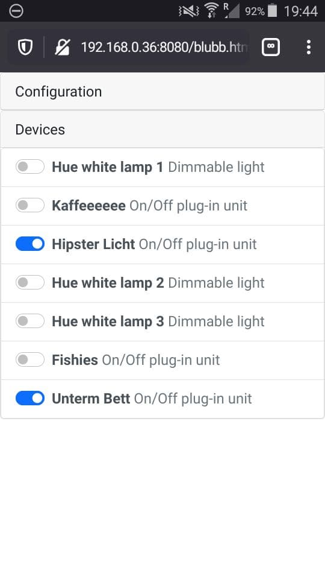
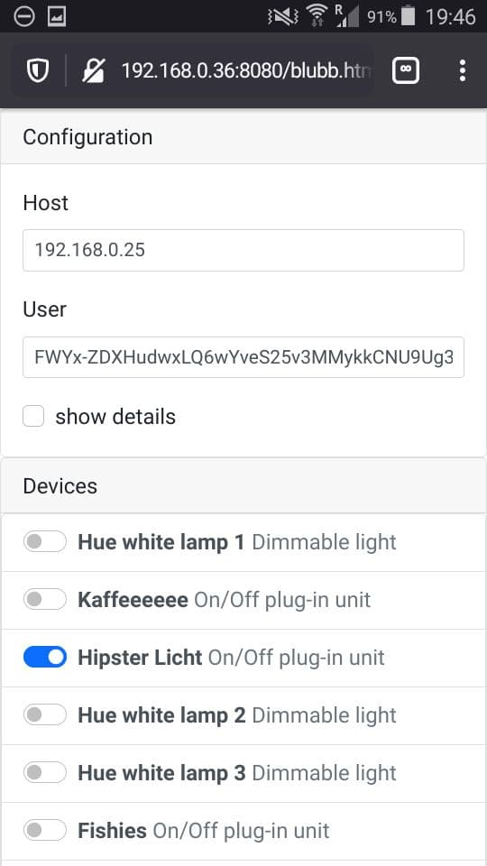

# hue-and-me

> Single html-file frontend for controlling devices through a local hue bridge

 

ToDo:
- [ ] continously sync state
- [ ] anything more advance than on/off

## Resources

- ~~http://www.burgestrand.se/hue-api/~~ completely outdated
- https://developers.meethue.com/develop/get-started-2/

- https://developers.meethue.com/develop/hue-api/

- npm package: https://github.com/sqmk/huejay

- http://192.168.0.25/debug/clip.html
- http://192.168.0.25/api/FWYx-ZDXHudwxLQ6wYveS25v3MMykkCNU9Ug3IG3/

## Setup

Found bridge ip via router: http://192.168.0.25/description.xml

### Create user

Note: preconfigured username can't be used since 2016... ([source](https://developers.meethue.com/important-whitelist-changes/))

```
curl -X POST http://$host5/api -H 'Content-Type:: application/json' -d '{"devicetype":"blubb-api-client"}'
```

```
[{"success":{"username":"FWYx-ZDXHudwxLQ6wYveS25v3MMykkCNU9Ug3IG3"}}]
```

### First steps

assuming `$username` and `$host`

- Config:
  
  ``` bash
  curl -s "http://$host/api/$username/config" | jq
  ```

- Lights:
  
  ``` bash
  curl -s "http://$host/api/$username/lights" | jq
  ```

- blink a ligh (alert)
  
  ``` bash
  curl -i  "http://$host/api/$username/lights/11/state" -X PUT -d '{"alert": "lselect"}'
  ```
  
  ``` bash
  curl -i  "http://$host/api/$username/groups/1/action" -X PUT -d '{"alert": "select"}'
  ```

- dimmable
  
  ``` bash
  curl -i  "http://$host/api/$username/groups/1/action" -X PUT -d '{"on": true, "transitiontime": 100, "bri": 254}'
  ```
